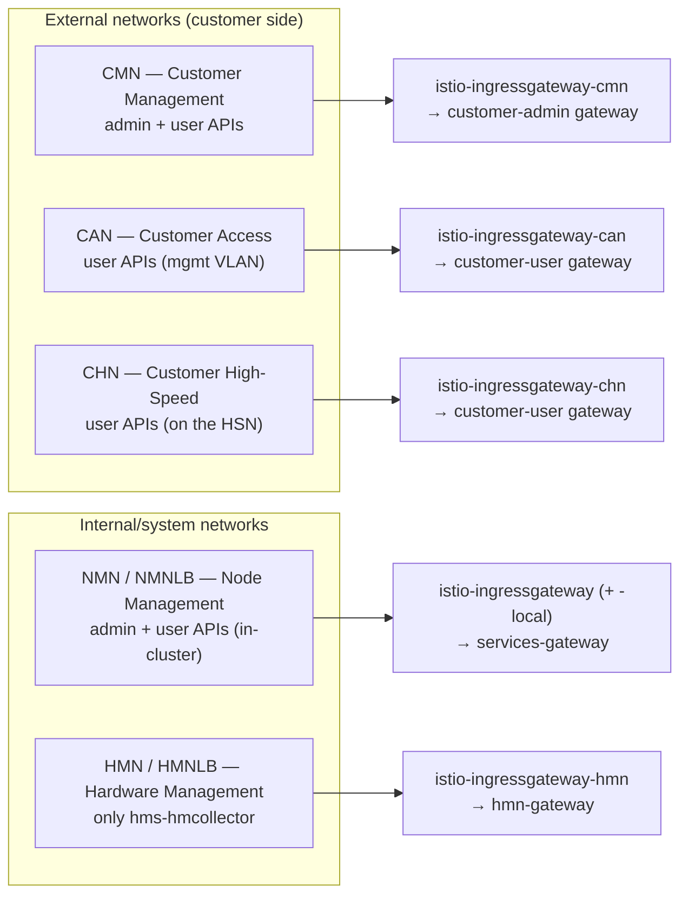
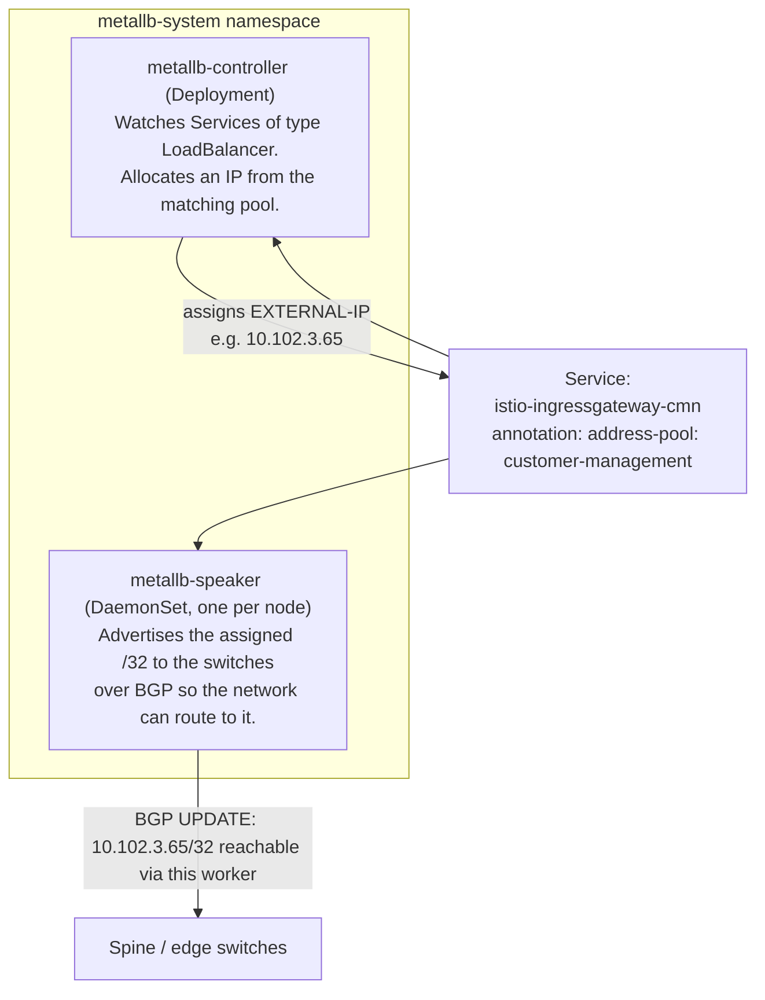
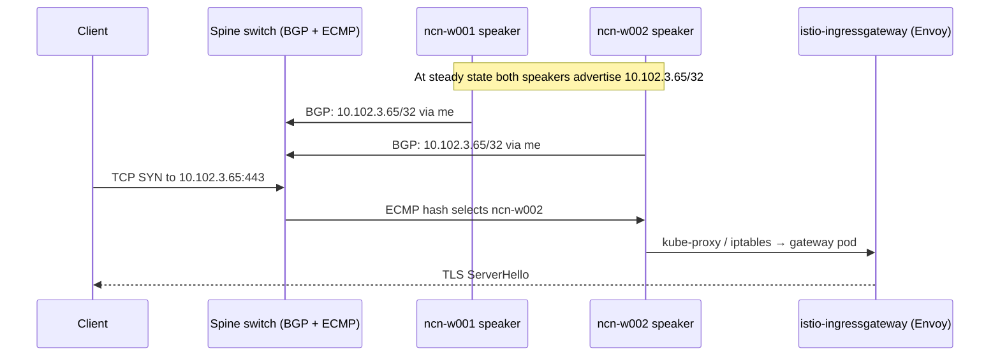
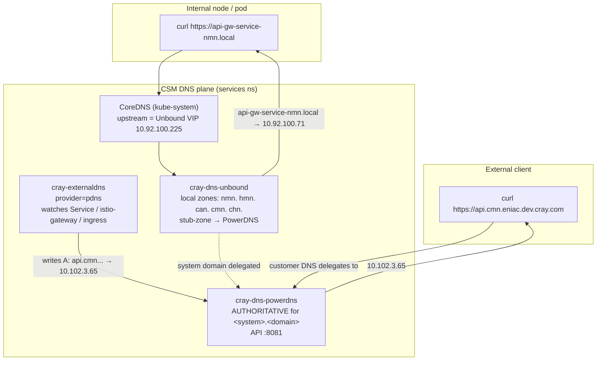
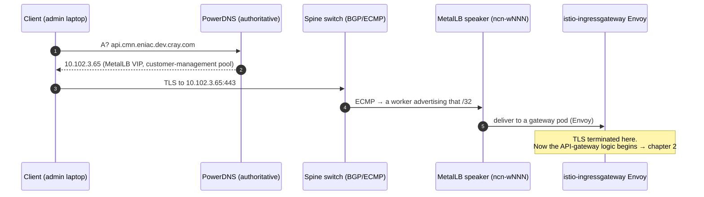

# 1. Networks & the Cluster Entry Point

> **Question answered:** *"Where does a request physically enter the cluster, and how
> does a name like `api.cmn.eniac.dev.cray.com` become a packet arriving at an Istio
> Envoy pod?"*

This chapter covers the three things that happen **before** Istio sees a request:

1. **Networks** — which network a client is on decides which APIs it can even reach.
2. **DNS** — how a hostname resolves to a load-balanced VIP.
3. **MetalLB** — how that VIP is advertised (BGP) and which worker receives the packet.

---

## 1.1 The CSM networks (and why they matter for the gateway)

CSM is multi-homed. The **same** API gateway is published on several networks, and the
network a request arrives on changes **which gateway**, **which OPA policy**, and
therefore **which APIs** are permitted. This is the "BiCAN" design.

| Network | Type | Audience | What is exposed | Notes |
|---------|------|----------|-----------------|-------|
| **CMN** (Customer Management) | External | Admins **and** users | Admin + user APIs, web UIs, system DNS | The normal "front door" for admins |
| **CAN** (Customer Access) | External | Users | User APIs only | On a management-switch VLAN. **Mutually exclusive with CHN** |
| **CHN** (Customer High-Speed) | External | Users | User APIs only | Rides the **High-Speed Network (HSN)**; peers with **Arista edge** switches |
| **NMN / NMNLB** (Node Management) | Internal | Admins + users (in-cluster, NCNs, computes) | Admin + user APIs | In-cluster name `api-gw-service-nmn.local` |
| **HMN / HMNLB** (Hardware Management) | Internal | Hardware | Only `cray-hms-hmcollector-ingress` | BMC/Redfish telemetry ingest |

**Default IP ranges** (`docs-csm/operations/network/Default_IP_Address_Ranges.md`):

| Network | Default CIDR |
|---------|--------------|
| Kubernetes service network | `10.16.0.0/12` |
| Kubernetes pod network | `10.32.0.0/12` |
| NMN (Node Management) | `10.252.0.0/17` |
| HMN (Hardware Management) | `10.254.0.0/17` |
| HSN (High Speed) | `10.253.0.0/16` |
| **NMNLB** (Load-balanced NMN) | `10.92.100.0/24` |
| **HMNLB** (Load-balanced HMN) | `10.94.100.0/24` |

CMN/CAN/CHN ranges are site-specific (set at install via `csi config init`).

> **Why a developer cares:** if an API "works from an NCN but not from a UAN", it is
> almost always because the UAN is on CAN/CHN where the **user** OPA policy applies, and
> the endpoint you are calling is admin-only. See the `gateway-test` output in
> [chapter 2](./02-api-gateway-and-request-flow.md#27-verifying-the-whole-path-gateway-test).

---

## 1.2 MetalLB — the L3 load balancer (the literal entry point)

Kubernetes has no built-in implementation for `type: LoadBalancer` Services on bare
metal. **MetalLB** provides it. Every externally reachable VIP you see in
`kubectl get svc -A` with an `EXTERNAL-IP` is handed out by MetalLB.

MetalLB has two pieces (both visible in your snapshot under `metallb-system`):

- **`metallb-controller`** (Deployment): the brain. Watches `LoadBalancer` Services and
  assigns each one an IP from the pool named in its
  `metallb.universe.tf/address-pool` annotation.
- **`metallb-speaker`** (DaemonSet, runs on every NCN): the voice. Advertises the
  assigned `/32` host routes to the switches so external traffic can find a worker.

**Modern CSM is CRD-based** (chart `cray-metallb`, upstream MetalLB `v0.14.9`). The
configuration is generated from `customizations.yaml` into three CRD kinds
(`cray-metallb/charts/cray-metallb/files/generate_metallb_crds.py`):

| CRD | Purpose |
|-----|---------|
| `IPAddressPool` | Defines a named range of IPs (one per pool) |
| `BGPPeer` | One per switch neighbor (`peerAddress`, `peerASN`, `myASN`) |
| `BGPAdvertisement` | Maps which pools are advertised to which peers |

### Address pools → networks → live IPs

| Pool name | Network | Live `EXTERNAL-IP` in your snapshot | Service |
|-----------|---------|-------------------------------------|---------|
| `node-management` | NMNLB `10.92.100.0/24` | `10.92.100.71` | `istio-ingressgateway` |
| `hardware-management` | HMNLB `10.94.100.0/24` | `10.94.100.71` | `istio-ingressgateway-hmn` |
| `customer-management` | CMN (dynamic `/26`) | `10.102.3.65` | `istio-ingressgateway-cmn` |
| `customer-access` | CAN (dynamic `/27`) | `10.102.3.161` | `istio-ingressgateway-can` |
| `customer-high-speed` | CHN (HSN) | `<pending>` (no CHN configured) | `istio-ingressgateway-chn` |

> The authoritative pool↔gateway↔hostname binding lives in
> `shasta-cfg/customizations.yaml` (the Istio ingress section). The chart `values.yaml`
> ships placeholder pools that are intentionally overridden there.

### BGP mode and ECMP (how a packet picks a worker)

CSM runs MetalLB in **BGP mode** for NMNLB, HMNLB, CAN, and CHN
(`docs-csm/operations/network/metallb_bgp/MetalLB_in_BGP-Mode.md`):

- Each `metallb-speaker` opens a **BGP session** to the spine switches (and Arista
  **edge** switches when CHN is used) and advertises the VIP `/32`s.
- The switches are configured with **ECMP** (`maximum-paths`), so a VIP load-balances
  across **every worker** that advertised it. Each new connection can land on a
  different gateway pod.
- BGP peering is **only** between the MetalLB speakers and the switches.

> **Failure mode preview:** if a Service shows `EXTERNAL-IP: <pending>`, the controller
> could not assign an IP (pool exhausted/missing). If the IP exists but is unreachable,
> BGP is likely down. Both are covered in
> [chapter 4 §4.6](./04-ingressgateway-logs-and-troubleshooting.md#46-the-network-layer-metallb--bgp).

---

## 1.3 DNS — turning a name into a VIP

Two DNS systems cooperate. **External** clients use PowerDNS; **internal**
nodes/pods use Unbound (via CoreDNS).

**How records get created automatically — `cray-externaldns`:**

- It watches **Services, Istio Gateways, and Ingresses**
  (`sources: [service, istio-gateway, ingress]`).
- For each, it reads the `external-dns.alpha.kubernetes.io/hostname` annotation and the
  Service's allocated `LoadBalancer` IP, then writes the **A record** into PowerDNS via
  its REST API (`http://cray-dns-powerdns-api:8081`).

Example: the `istio-ingressgateway-cmn` Service is annotated with
`address-pool: customer-management` and
`hostname: api.cmn.<domain>,auth.cmn.<domain>,nexus.cmn.<domain>,vault.cmn.<domain>`.
MetalLB assigns `10.102.3.65`; external-dns publishes
`api.cmn.<domain> → 10.102.3.65`; the customer's upstream DNS delegates the system
subdomain to PowerDNS. Done.

**Internal names:** Unbound is authoritative for the local management zones
(`nmn. hmn. mtl. hsn. can. cmn. chn.`) and stub-delegates the external system domain to
PowerDNS. CoreDNS (the cluster resolver) forwards to Unbound's NMNLB VIP
`10.92.100.225`. The ubiquitous internal name **`api-gw-service-nmn.local`** is just the
NMN Istio gateway at `10.92.100.71`.

> **Trailing-dot gotcha (historical, CASMINST-1166):** internal `.local` names are used
> with a **trailing dot** in several configs (e.g. the OPA JWKS URI
> `https://istio-ingressgateway.istio-system.svc.cluster.local./...`). The trailing dot
> forces an absolute lookup and avoids search-domain expansion. Preserve it.

---

## 1.4 Putting the entry point together

End-to-end, a single external API call traverses **four** systems before Istio routing:

**Continue to [chapter 2 — the API gateway and request flow](./02-api-gateway-and-request-flow.md).**
