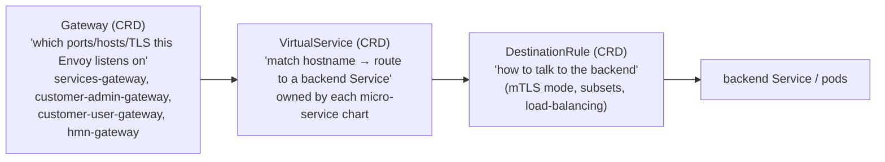
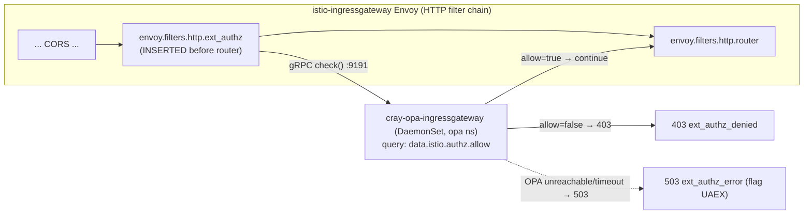
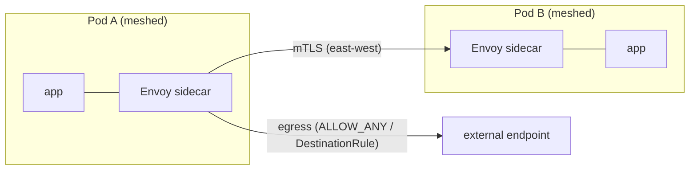

# 2. The API Gateway & Request Flow

> **Question answered:** *"Once a packet reaches an Istio Envoy pod, how is it
> authenticated, authorized, and routed to the correct micro-service — and what is the
> exact end-to-end path of an API request?"*

The CSM "API gateway" is the combination of:

1. **Istio ingress gateways** (Envoy) — TLS termination + L7 routing (the front door).
2. **OPA** (`ext_authz`) — the authorization decision point (the gate).
3. **Keycloak** and **SPIRE** — the JWT issuers/verifiers (the identity).
4. **OAuth2 Proxy** — the browser-to-JWT bridge (for web UIs).

---

## 2.1 The ingress gateways (data plane)

There are **two layers**: the Envoy **Deployments** (the pods that process traffic) and
the **LoadBalancer Services** (the network attachment points). Several Services can point
at the same Deployment — this is how one set of Envoy pods serves multiple networks.

### Gateway Deployments (Envoy pods) — `cray-istio-ingress/values.yaml`

| Deployment | Pod label `istio:` | Serves network(s) | Key ports |
|------------|--------------------|--------------------|-----------|
| `istio-ingressgateway` (default) | `ingressgateway` | **NMN** | 8080 http, 8443 https, **8081 tls-spire**, **8883 mqtt-secure**, 8888 cloud-init |
| `istio-ingressgateway-customer-admin` | `ingressgateway-customer-admin` | **CMN** | 8080, 8443 |
| `istio-ingressgateway-customer-user` | `ingressgateway-customer-user` | **CAN + CHN** | 8080, 8443 |
| `istio-ingressgateway-hmn` | `istio-ingressgateway-hmn` | **HMN** | 8080, 8443, 8888 |

All are autoscaled **min 3 / max 6** (HPA — visible in your snapshot) so the gateway is
never dependent on a single node.

### LoadBalancer Services (network attachment)

| Service | Selects deployment | Pool / network | `externalTrafficPolicy` |
|---------|--------------------|----------------|--------------------------|
| `istio-ingressgateway` | `ingressgateway` | `node-management` / NMNLB | Cluster |
| `istio-ingressgateway-local` | `ingressgateway` | `node-management` / NMNLB | **Local** (preserves client source IP) |
| `istio-ingressgateway-hmn` | `istio-ingressgateway-hmn` | `hardware-management` / HMNLB | Cluster |
| `istio-ingressgateway-cmn` | `ingressgateway-customer-admin` | `customer-management` / CMN | Cluster |
| `istio-ingressgateway-can` | `ingressgateway-customer-user` | `customer-access` / CAN | Cluster |
| `istio-ingressgateway-chn` | `ingressgateway-customer-user` | `customer-high-speed` / CHN | Cluster |

> **`-local` and source IP:** the default `Cluster` policy may SNAT the client IP. The
> `-local` Service uses `externalTrafficPolicy: Local`, which **preserves the original
> client IP** (important for the cloud-init `meta-data`/`user-data` flow, where OPA
> authorizes based on the source IP rather than a token).

### `Gateway`, `VirtualService`, `DestinationRule` — the three Istio CRDs



- **`Gateway`** (4 of them, in namespace `services`): bind a set of **ports + hostnames +
  TLS** to a gateway Deployment. TLS termination is here:
  - `8443` HTTPS → `mode: SIMPLE`, credential **`ingress-gateway-cert`** (issued by
    cert-manager; SANs cover `*.cmn/can/chn/nmn/hmn.<domain>`).
  - `8081` TLS → `mode: PASSTHROUGH` (SPIRE mTLS — the gateway does not decrypt; it
    forwards to the SPIRE server).
  - `8883` TLS → `mode: SIMPLE`, credential `dvs-mqtt-cert` (DVS MQTT bus).
  - `8080` HTTP → `httpsRedirect: true`.
- **`VirtualService`** (one per micro-service, shipped by that service's own chart):
  matches the external hostname in `spec.http.match.authority.exact` and routes to the
  backend Service. It **reuses** the shared `Gateway`s — it does not create new ones.
- **`DestinationRule`**: configures *how* to reach the backend (usually
  `mode: ISTIO_MUTUAL` for mTLS; CSM disables TLS to a few non-mesh endpoints such as
  SMA Kafka).

Concrete example (`docs-csm/.../external_dns/Ingress_Routing.md`) — Grafana's
`VirtualService` binds `services/services-gateway` + `services/customer-admin-gateway`,
matches `grafana.cmn.<domain>`, routes to `cray-sysmgmt-health-grafana:80`, and rewrites
auth headers.

---

## 2.2 OPA — the authorization gate (`ext_authz`)

Every request that enters a gateway is paused and sent to **OPA** for an allow/deny
decision **before** routing. This is wired with an Istio **`EnvoyFilter`**.



Key facts (`cray-opa/kubernetes/cray-opa/`):

- The `EnvoyFilter` (`templates/envoyfilter.yaml`) inserts `envoy.filters.http.ext_authz`
  **before** the router, with `context: GATEWAY`, calling
  `<gateway>.opa.svc.cluster.local:9191` over gRPC.
- `status_on_error: ServiceUnavailable` → if OPA cannot be reached or times out, the
  client gets **503** (this is the `UAEX` / `ext_authz_error` you see in logs).
- `timeout: 25s` (deliberately long; raised to fix historical "deadline exceeded" gRPC
  errors — see CASMPET-1804/2570 referenced in `values.yaml`).
- There is a **separate OPA DaemonSet per gateway** (`cray-opa-ingressgateway`,
  `…-customer-admin`, `…-customer-user`, `…-hmn`), each loaded with the policy set
  appropriate to that network.

### The OPA policies (Rego)

OPA evaluates the query `data.istio.authz.allow`. The policy bundle is assembled from
ConfigMaps generated per gateway (`templates/policies/`):

| Policy | Applied to | What it allows |
|--------|-----------|----------------|
| `keycloak-admin` | NMN, CMN | `admin` persona → every endpoint |
| `keycloak-user` | NMN, CMN, CAN, CHN | `user`, `wlm`, `ckdump`, `slingshot-*` personas → specific endpoint+method lists |
| `keycloak-system` | NMN | `system-pxe`, `system-compute` personas (boot/config of nodes) |
| `spire` | NMN | SPIFFE workload identities (compute-node daemons) |
| `hmn` | HMN | only the `hms-hmcollector` ingest path |
| `base` | all | shared helpers |

Each gateway's policy is configured in `values.yaml` under `ingresses.<gateway>.policies`
— e.g. the **customer-user** gateway has `keycloak.user: true` but `admin: false` and
`spire: false`, which is *why* admin APIs are unreachable from CAN/CHN.

**What the policy actually checks** (from `keycloak-user.yaml`):

1. **Whitelisted paths** that do their own auth are allowed outright — Keycloak OIDC
   endpoints, Gitea (`/vcs`), Nexus (`/repository`, `/v2`, `/service/rest`), cloud-init
   (`/meta-data`, `/user-data`, by source IP), and browser UIs (Grafana/Kibana/Nexus,
   which authenticate via OAuth2 Proxy).
2. **Token extraction** — reads `Authorization: Bearer <jwt>` (or
   `x-forwarded-access-token` from OAuth2 Proxy).
3. **JWT verification** — calls `io.jwt.decode_verify`, fetching the signing keys from
   the **JWKS** endpoint with `http.send(..., cache: true)`:
   - Keycloak JWKS:
     `https://istio-ingressgateway.istio-system.svc.cluster.local./keycloak/realms/shasta/protocol/openid-connect/certs`
   - SPIRE JWKS:
     `https://istio-ingressgateway.istio-system.svc.cluster.local./spire-jwks-vshastaio/keys`
     and `http://cray-spire-jwks.spire.svc.cluster.local/keys`
   - It validates the audience (`aud: shasta`) and the **issuer** (`iss`).
4. **Role → endpoint mapping** — extracts roles from
   `resource_access.shasta.roles` and matches the request method+path against the
   per-role allow-list (e.g. `wlm` may `POST /apis/bos/v2/sessions`).

> **This is the crux of CSM API security:** the micro-services largely trust that
> anything reaching them was already authorized. OPA at the gateway is the single
> enforcement point. If OPA's JWKS fetch fails (Keycloak or SPIRE down/unreachable),
> **every** token-bearing request fails — which is why an auth-plane outage looks like a
> total API outage.

---

## 2.3 Identity providers: Keycloak vs SPIRE

CSM has **two** token issuers for two kinds of caller:

```mermaid
flowchart TB
    subgraph humans["Humans & services"]
        kc["Keycloak (OIDC)<br/>realm: shasta"]
        kc --> jwtA["JWT<br/>iss = .../keycloak/realms/shasta<br/>roles: admin / user / wlm / ..."]
    end
    subgraph workloads["Compute / system workloads"]
        sp["SPIRE (SPIFFE)<br/>server + per-node agents"]
        sp --> jwtB["JWT-SVID<br/>iss = http://spire.local/shasta/vshastaio<br/>sub = spiffe://shasta/compute/workload/dvs-map<br/>aud = system-compute"]
    end
    jwtA --> opa["OPA ext_authz at the gateway"]
    jwtB --> opa
```



| | **Keycloak** | **SPIRE** |
|--|--------------|-----------|
| Identity model | OIDC users/clients in realm `shasta` | SPIFFE IDs (`spiffe://shasta/...`) |
| Who uses it | Admins, `cray` CLI, SAT, service accounts | Compute-node & NCN daemons (e.g. `dvs-map`, heartbeat) |
| Token | Bearer JWT with `resource_access.shasta.roles` | JWT-SVID with `sub`/`aud` |
| Verified by OPA via | Keycloak JWKS (through the gateway) | SPIRE JWKS (`cray-spire-jwks`, through the gateway) |
| In your snapshot | `cray-keycloak` **Init (down)** | `cray-spire-agent` **CrashLoopBackOff (down)** |

How a human gets a token (`docs-csm/.../Retrieve_an_Authentication_Token.md`):

```bash
# Admin client secret lives in Kubernetes; the CLI exchanges it for a JWT at Keycloak.
TOKEN=$(curl -s -d grant_type=client_credentials \
  -d client_id=admin-client \
  -d client_secret="$(kubectl get secret admin-client-auth -o jsonpath='{.data.client-secret}' | base64 -d)" \
  https://auth.cmn.<system>.<domain>/keycloak/realms/shasta/protocol/openid-connect/token | jq -r .access_token)

curl -H "Authorization: Bearer $TOKEN" https://api.cmn.<system>.<domain>/apis/smd/hsm/v2/State/Components
```

---

## 2.4 OAuth2 Proxy — the path for browser web apps

Browser apps (Grafana, Kiali, Kibana, Alertmanager, OpenSearch Dashboards) cannot easily
attach a bearer token to every request, so they go through **OAuth2 Proxy**
(`cray-oauth2-proxy`), exposed as the `cray-oauth2-proxies-customer-*-ingress`
LoadBalancer services in your snapshot.

```mermaid
sequenceDiagram
    autonumber
    participant B as Browser
    participant O as OAuth2 Proxy
    participant KC as Keycloak
    participant GW as Istio gateway and OPA
    participant APP as Web app (e.g. Grafana)

    B->>O: GET grafana.cmn.DOMAIN (no session)
    O->>B: 302 redirect to Keycloak login
    B->>KC: login (user/pass or SSO)
    KC-->>B: auth code → OAuth2 Proxy
    B->>O: callback with code
    O->>KC: exchange code → JWT
    O->>GW: forward request + JWT (x-forwarded-access-token)
    GW->>GW: OPA allows whitelisted web-app host
    GW->>APP: route; inject X-WEBAUTH-USER, strip Authorization
    APP-->>B: page
```

The OPA `keycloak-user` policy explicitly whitelists these web-app upstreams by their
`x-envoy-decorator-operation` (e.g. `cray-sysmgmt-health-grafana...:80/*`), because the
app itself trusts the injected identity headers.

---

## 2.5 End-to-end request path traversal (the whole journey)

Here is the complete life of a typical authenticated API call,
`GET /apis/smd/hsm/v2/State/Components`, from an admin laptop on CMN:

```mermaid
sequenceDiagram
    autonumber
    participant C as Client (cray CLI)
    participant DNS as PowerDNS
    participant SW as Spine switch (BGP/ECMP)
    participant GW as istio-ingressgateway-customer-admin (Envoy)
    participant OPA as cray-opa-...-customer-admin
    participant KC as Keycloak (JWKS)
    participant SC as cray-smd sidecar (Envoy)
    participant SVC as cray-smd app

    C->>DNS: resolve api.cmn.DOMAIN
    DNS-->>C: 10.102.3.65 (MetalLB VIP)
    C->>SW: HTTPS + Bearer JWT
    SW->>GW: ECMP → gateway pod; TLS terminated
    GW->>OPA: ext_authz gRPC (method, path, headers, JWT)
    OPA->>KC: fetch JWKS (cached) & verify signature/iss/aud
    OPA->>OPA: map roles → is GET /apis/smd/... allowed?
    OPA-->>GW: allow = true
    GW->>GW: VirtualService matches authority → cray-smd:80
    GW->>SC: route over mTLS (ISTIO_MUTUAL)
    SC->>SVC: plaintext on localhost inside the pod
    SVC-->>SC: 200 + body
    SC-->>GW: 200 (mTLS)
    GW-->>C: 200 + body
    Note over GW: One access-log line is emitted here →<br/>"GET /apis/smd/... 200 via_upstream ..."
```

**Decision points that produce the common status codes:**

| Where | Outcome | Client sees | Log signature |
|-------|---------|-------------|---------------|
| MetalLB/BGP | No route / no VIP | connection refused / timeout | (nothing in Envoy) |
| TLS at gateway | Cert/SNI mismatch | TLS handshake error | `UF,URX` "Secret is not supplied by SDS" |
| OPA reachable? | OPA down/slow | **503** | `503 UAEX ext_authz_error` |
| OPA decision | Token missing/invalid/insufficient role | **403** | `403 ... ext_authz_denied` |
| Routing | No `VirtualService` for host/path | **404** | `404 ... route_not_found` |
| Upstream | Backend pod unhealthy | **503** | `503 UH/UF/URX via_upstream` |
| Success | Allowed + routed | **200/204** | `200 ... via_upstream` |

This table is the backbone of [chapter 4 troubleshooting](./04-ingressgateway-logs-and-troubleshooting.md).

---

## 2.6 Ingress vs egress traffic

- **Ingress (north-south, into the cluster):** external client → MetalLB → ingress
  gateway → OPA → mesh → service. This is everything above.
- **East-west (service-to-service inside the mesh):** pod → its Envoy sidecar → peer's
  Envoy sidecar → peer pod, transparently **mTLS**-encrypted. No ingress gateway and
  **no OPA** is involved for in-mesh calls — OPA only guards the *edge*.
- **Egress (out of the cluster):** by default Istio allows pods to reach external
  endpoints (`ALLOW_ANY` outbound). Specific external dependencies are modeled with
  `DestinationRule`s (e.g. CSM **disables** TLS-origination to SMA Kafka so the sidecar
  does not wrap an already-plain connection). There is no dedicated egress gateway in the
  default CSM profile.



---

## 2.7 Verifying the whole path (gateway-test)

CSM ships a test that exercises this entire flow per network
(`docs-csm/operations/network/Gateway_Testing.md`):

```bash
/usr/share/doc/csm/scripts/operations/gateway-test/ncn-gateway-test.sh
```

It fetches a Keycloak token on each network, then calls each service and checks the
status. The expected results are themselves a great teaching tool:

```text
------------- api-gw-service-nmn.local (admin token on NMN) ------------
PASS - [cray-smd]: .../apis/smd/hsm/v2/service/ready - 200   ← allowed + routed
------------- api.chn.<domain> (admin token on CHN) --------------------
PASS - [cray-smd]: .../apis/smd/hsm/v2/service/ready - 404   ← reachable, but admin VS not on CHN
------------- api-gw-service-nmn.local (user token, admin API) ---------
PASS - [cray-smd]: .../apis/smd/hsm/v2/service/ready - 403   ← OPA denied (wrong persona)
```

A `200` means allowed; a `403` means OPA denied (network/persona mismatch — *by design*);
a `404` means the `VirtualService` for that host is intentionally absent on that network.

**Continue to [chapter 3 — the service mesh, discovery & observability](./03-service-mesh-discovery-observability.md).**
