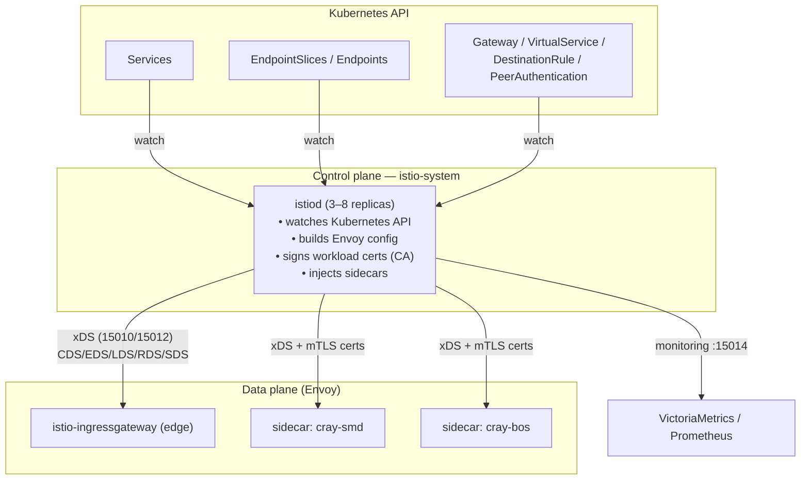
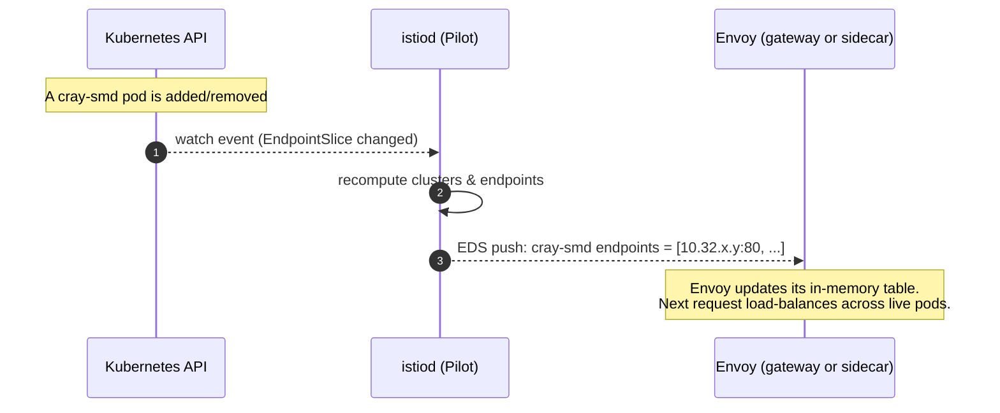
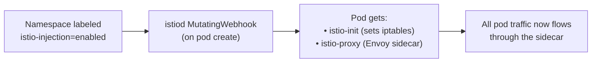
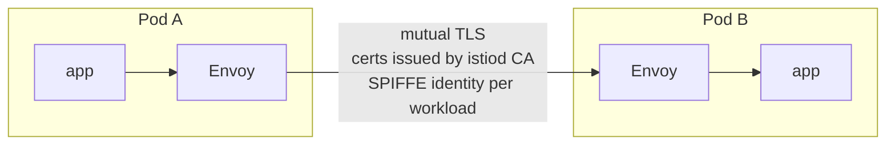
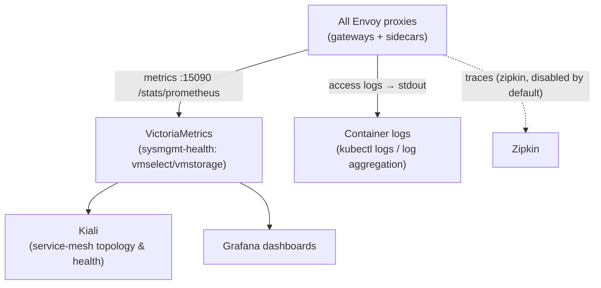

# 3. Service Mesh, Service Discovery & Observability

> **Questions answered:** *"How does Istio know which services and pods exist? How does
> it monitor and secure traffic? What is endpoint discovery, and how do I observe the
> mesh?"*

Chapters 1–2 followed a request from the wire to a service. This chapter explains the
**control plane** that makes that routing possible, and how the mesh is **monitored**.

---

## 3.1 The mesh in one picture

Istio has a **control plane** (`istiod`) and a **data plane** (Envoy proxies — both the
ingress gateways and the per-pod sidecars). The control plane never touches request
traffic; it only **configures** the data plane.

`istiod` configuration in CSM lives in `cray-istio/kubernetes/cray-istio-pilot/values.yaml`
(upstream `istiod` chart, image `1.26.0-cray1-distroless`):

- `replicaCount: 3`, autoscale **3–8**.
- `meshConfig.accessLogFile: /dev/stdout` — turns on Envoy access logs mesh-wide
  (critical for chapter 4).
- `defaultConfig.holdApplicationUntilProxyStarts: true` — app containers wait for the
  sidecar to be ready (prevents startup traffic loss).
- `tracing.zipkin.address: zipkin.istio-system.svc.cluster.local:9411`.
- `JWT_POLICY: third-party-jwt`.

---

## 3.2 Service discovery & endpoint discovery (xDS)

This is the heart of "how does Istio know where to send traffic."

**Service discovery** = *what services exist and what hostnames they have.*
**Endpoint discovery** = *which concrete pod IP:port back each service right now.*

`istiod` **watches the Kubernetes API** for `Service` and `EndpointSlice` objects (plus
Istio CRDs), translates them into Envoy's configuration model, and **pushes** them to
every Envoy over the **xDS** gRPC protocol. Envoys do not query DNS or Kubernetes per
request — they already hold an up-to-date routing table.

The xDS sub-protocols, mapped to plain English:

| xDS API | Envoy concept | CSM meaning |
|---------|---------------|-------------|
| **LDS** (Listener) | Ports/filters to listen on | The gateway's 8080/8443/8081 listeners + the `ext_authz` filter |
| **RDS** (Route) | HTTP route rules | Your `VirtualService` host/path → cluster mappings |
| **CDS** (Cluster) | Upstream service | Each backend Service (e.g. `outbound|80||cray-smd.services.svc.cluster.local`) |
| **EDS** (Endpoint) | Pod IPs behind a cluster | The live pod endpoints (from EndpointSlices) |
| **SDS** (Secret) | TLS certs/keys | The `ingress-gateway-cert` and per-workload mTLS certs |

`istiod` serves xDS on two ports (`istiod` Service): **15010** (plaintext gRPC-xDS) and
**15012** (mTLS xDS + the CA that signs workload certificates). Monitoring/health is on
**15014**; the sidecar-injection and config-validation webhooks on `443→15017`.

> **Why the `UPSTREAM_CLUSTER` in the access log reads
> `outbound|80||cray-smd.services.svc.cluster.local`:** that string *is* the CDS cluster
> name istiod generated for the `cray-smd` Service. The access log is literally telling
> you which discovered cluster the request was routed to.

### Two layers of "discovery" — don't confuse them

- **DNS resolution** (chapter 1: CoreDNS → Unbound/PowerDNS) resolves a *name* to a
  *Service ClusterIP or LoadBalancer VIP*. This is standard Kubernetes/host DNS.
- **Istio endpoint discovery** (this chapter: istiod xDS) resolves a *Service* to the
  *set of healthy pod IPs* and load-balances across them.

Both are "service discovery," but they operate at different layers. A request uses DNS to
find the gateway, then the mesh's xDS-programmed routing to find the pod.

---

## 3.3 Sidecar injection — how a pod joins the mesh

A pod becomes "meshed" when Istio injects an **`istio-proxy` (Envoy) sidecar** container
into it. In your snapshot, this is why most `services`-namespace pods show `2/2` or `3/3`
READY — one of those containers is the sidecar.

- Injection is **opt-in per namespace** via the label **`istio-injection: enabled`**
  (the upstream `MutatingWebhook` matches it). A pod can opt out with
  `sidecar.istio.io/inject: "false"`.
- **Meshed namespaces** in CSM (from `cray-drydock/.../namespaces.yaml`): `services`,
  `nexus`, `uas`, `spire`, `pki-operator`, `vault`, `tapms-operator`, `slurm-operator`,
  `hnc-system`, `argo`, `dvs`, `cert-manager`.
- **Deliberately not meshed:** `operators`, `user`, `kyverno`, `multi-tenancy`.
- The **ingress gateway pods themselves opt out** of injection (they *are* Envoy already).

The sidecar's `istio-init` container programs iptables so that **all** inbound/outbound
TCP for the pod is transparently redirected through Envoy — the application needs no code
changes.

---

## 3.4 mTLS — how east-west traffic is secured

- **Auto-mTLS is on mesh-wide** (`global.mtls.enabled: true` + `auto: true`). Sidecar
  traffic is transparently encrypted with certificates the `istiod` CA issues to each
  workload (identity = its Kubernetes service account, expressed as a SPIFFE ID).
- The **ingress gateway** carries a `PeerAuthentication` of **`PERMISSIVE`** — it must
  accept plaintext/standard TLS from *outside* the mesh (real clients), then speak mTLS
  *into* the mesh.
- Per-service `DestinationRule`s set `ISTIO_MUTUAL` for backend calls; `trustDomain` is
  `cluster.local`.
- CSM ships **no `STRICT` mesh-wide PeerAuthentication**; enforcement is via auto-mTLS +
  the edge being the only authorization point.

> **Operational tie-in:** the `UF,URX` "Secret is not supplied by SDS" 503 in chapter 4
> is an mTLS/SDS hiccup — Envoy briefly lacked the cert (SDS = the SDS xDS channel from
> istiod). A rolling restart re-establishes it.

---

## 3.5 Observability — monitoring the mesh

Because every request crosses an Envoy, the mesh is highly observable. CSM wires three
signals:

| Signal | Where it goes | How to use it |
|--------|---------------|---------------|
| **Metrics** | Envoy exposes Prometheus metrics; scraped into **VictoriaMetrics** (`sysmgmt-health` namespace: `vmselect-vms`, `vmstorage-vms`, `vmagent-vms`). | Request rates, p50/p99 latency, 5xx ratios per service. |
| **Access logs** | Envoy writes one line per request to **stdout** (`meshConfig.accessLogFile: /dev/stdout`). | The primary forensic tool — see chapter 4. |
| **Traces** | Zipkin address configured; **disabled by default** in CSM. | Distributed traces if enabled. |

### Kiali — the mesh map

`cray-kiali` deploys **Kiali**, the service-mesh console. It reads metrics from
VictoriaMetrics' Prometheus-compatible endpoint
(`http://vmselect-vms.sysmgmt-health.svc.cluster.local:8481/select/0/prometheus`) and
renders:

- The **topology graph** (who calls whom, request rates, error rates).
- Per-service/-workload **health** and Istio config validation.
- The applied `VirtualService`/`DestinationRule`/`Gateway` objects.

Kiali is reached through OAuth2 Proxy on CMN (`kiali-istio.cmn.<domain>`), authenticates
`anonymous` (the edge already enforced identity), and is **optional/removable**. It is the
fastest way to answer "which service is throwing 5xx and what depends on it."

> In your snapshot, `kiali-688dbf685-x4zb7` is `1/1 Running` — the mesh map is available.

---

## 3.6 Quick reference — control-plane ports

| Port | On | Purpose |
|------|----|---------|
| 15010 | istiod | xDS (plaintext gRPC) |
| 15012 | istiod | xDS + CA (mTLS) |
| 15014 | istiod | monitoring/health |
| 15017 | istiod (via 443) | sidecar-injection & validation webhooks |
| 15021 | sidecar | health (`/healthz/ready`) |
| 15090 | sidecar/gateway | Envoy Prometheus metrics |
| 15000 | sidecar/gateway | Envoy admin (config dump, debugging) |

`istioctl proxy-config {clusters,endpoints,routes,listeners} <pod>` dumps exactly what
istiod pushed to a given Envoy — invaluable when routing looks wrong.

**Continue to [chapter 4 — ingress gateway logs & troubleshooting](./04-ingressgateway-logs-and-troubleshooting.md).**
