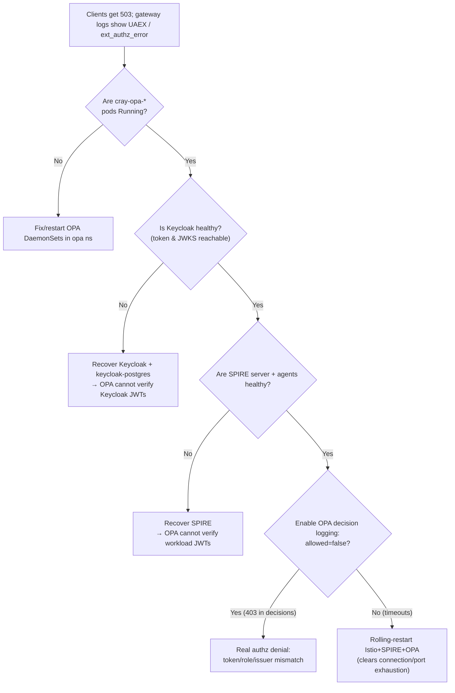
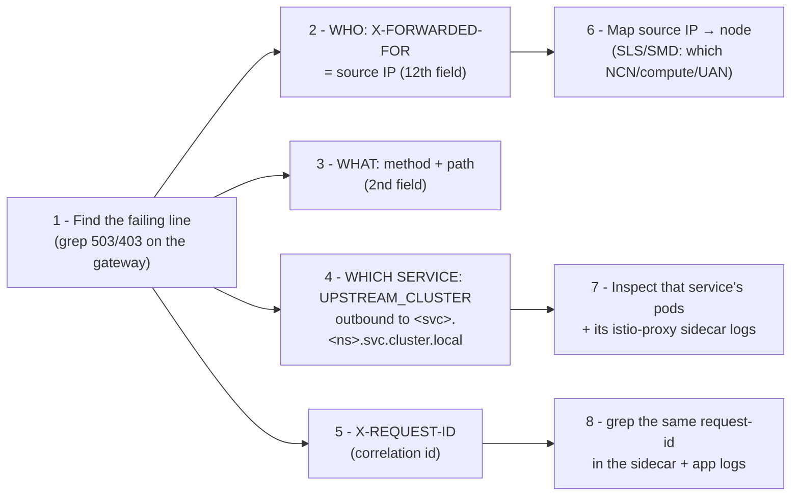
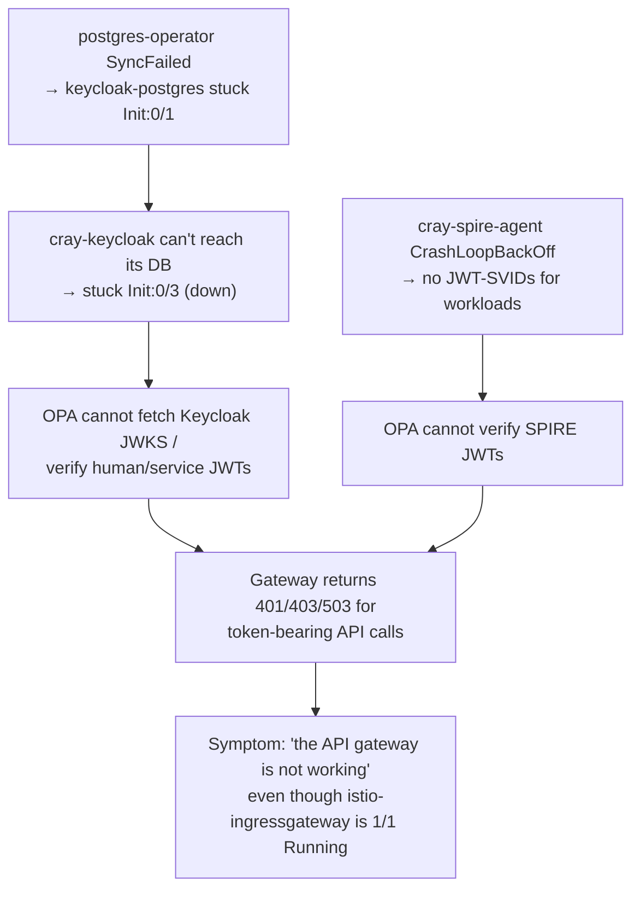

# 4. Ingress Gateway Logs & Troubleshooting

> **Questions answered:** *"How do I read `istio-ingressgateway` logs (status code, type
> of request, source IP)? How do I trace a request back to where it came from and which
> service caused an outage? Why is the API gateway 'not working' and how do I fix it?"*

This is the operational chapter. It assumes the architecture from chapters 1–3.

---

## 4.1 The single most useful command

Every request that crosses an ingress gateway produces **one access-log line** on the
gateway pod's stdout. To watch them live:

```bash
# Tail all ingress gateway pods; filter to errors.
kubectl -n istio-system logs -l istio=ingressgateway -f --max-log-requests=10 \
  | grep -E ' 50[0-9] | 40[0-9] '

# Count UAEX (authz) errors per gateway pod over the last minute:
for p in $(kubectl -n istio-system get pods -l app=istio-ingressgateway -o name); do
  echo "$p: $(kubectl -n istio-system logs "$p" --since=1m | grep -c UAEX)"
done
```

For a **backend service** (sidecar) the Envoy container is named `istio-proxy`:

```bash
kubectl logs <pod> -n <namespace> -c istio-proxy | grep ' 503 '
```

---

## 4.2 The access-log format, decoded field by field

CSM uses Istio's **default** Envoy text log format (no custom format is configured;
`accessLogFormat: ""` → Istio default). The format string is defined in
`istio/pilot/pkg/model/telemetry_logging.go`:

```text
[%START_TIME%] "%REQ(:METHOD)% %REQ(X-ENVOY-ORIGINAL-PATH?:PATH)% %PROTOCOL%"
 %RESPONSE_CODE% %RESPONSE_FLAGS% %RESPONSE_CODE_DETAILS% %CONNECTION_TERMINATION_DETAILS%
 "%UPSTREAM_TRANSPORT_FAILURE_REASON%" %BYTES_RECEIVED% %BYTES_SENT% %DURATION%
 %RESP(X-ENVOY-UPSTREAM-SERVICE-TIME)% "%REQ(X-FORWARDED-FOR)%" "%REQ(USER-AGENT)%"
 "%REQ(X-REQUEST-ID)%" "%REQ(:AUTHORITY)%" "%UPSTREAM_HOST%" %UPSTREAM_CLUSTER_RAW%
 %UPSTREAM_LOCAL_ADDRESS% %DOWNSTREAM_LOCAL_ADDRESS% %DOWNSTREAM_REMOTE_ADDRESS%
 %REQUESTED_SERVER_NAME% %ROUTE_NAME%
```

Take a **real failing line** from a CSM incident (CAST-34282) and map every field:

```text
[2023-10-09T18:22:48.170Z] "GET /apis/smd/hsm/v2/State/Components?role=management&role=application HTTP/2" 503 UAEX ext_authz_error - "~~" 0 0 25001 - "10.42.192.0" "curl/8.0.1" "26bccc49-f153-4de9-9405-42866b80e05d" "api-gw-service-nmn.local" "~~" outbound|80||cray-smd.services.svc.cluster.local - 10.32.0.15:443 10.42.192.0:21661 api-gw-service-nmn.local -
```

| # | Field | Value | Meaning |
|---|-------|-------|---------|
| 1 | `START_TIME` | `2023-10-09T18:22:48.170Z` | When the request started |
| 2 | **method + path + protocol** | `GET /apis/smd/hsm/v2/State/Components?... HTTP/2` | **The type of request** (verb, API path, HTTP version) |
| 3 | **`RESPONSE_CODE`** | `503` | **The HTTP status returned** |
| 4 | **`RESPONSE_FLAGS`** | `UAEX` | **Envoy's short reason code** (here: denied/blocked by ext-authz) |
| 5 | `RESPONSE_CODE_DETAILS` | `ext_authz_error` | Long reason (OPA call failed) |
| 6 | `CONNECTION_TERMINATION_DETAILS` | `-` | (none) |
| 7 | `UPSTREAM_TRANSPORT_FAILURE_REASON` | `~~`/`-` | TLS/connect failure reason to upstream |
| 8 | `BYTES_RECEIVED` | `0` | Request body bytes |
| 9 | `BYTES_SENT` | `0` | Response body bytes |
| 10 | `DURATION` | `25001` | ms — note **~25 s** = the OPA `timeout: 25s` elapsed |
| 11 | `X-ENVOY-UPSTREAM-SERVICE-TIME` | `-` | Upstream service time (never reached upstream) |
| 12 | **`X-FORWARDED-FOR`** | `10.42.192.0` | **The source IP — where the request came from** |
| 13 | `USER-AGENT` | `curl/8.0.1` | Client tool |
| 14 | **`X-REQUEST-ID`** | `26bccc49-...` | **Correlation ID** (trace this across pods) |
| 15 | **`:AUTHORITY`** | `api-gw-service-nmn.local` | The **Host** the client asked for (which gateway/network) |
| 16 | `UPSTREAM_HOST` | `~~`/`-` | The actual backend pod IP:port chosen (empty = none) |
| 17 | **`UPSTREAM_CLUSTER`** | `outbound\|80\|\|cray-smd.services.svc.cluster.local` | **Which service it was being routed to** |
| 18 | `UPSTREAM_LOCAL_ADDRESS` | `-` | Gateway's local socket to upstream |
| 19 | `DOWNSTREAM_LOCAL_ADDRESS` | `10.32.0.15:443` | The gateway pod IP:port that accepted the request |
| 20 | `DOWNSTREAM_REMOTE_ADDRESS` | `10.42.192.0:21661` | Immediate peer IP:port (post-SNAT in `Cluster` policy) |
| 21 | `REQUESTED_SERVER_NAME` | `api-gw-service-nmn.local` | TLS SNI |
| 22 | `ROUTE_NAME` | `-` | Matched route name (if any) |

So from **one line** you read: *who* (`10.42.192.0`, `curl`), *what*
(`GET /apis/smd/...`), *to which service* (`cray-smd`), *result* (`503`), *why*
(`UAEX ext_authz_error`), and a *correlation id* to follow it everywhere else.

### Compare three outcomes for the same request (from CAST-34306)

```text
200 (success):
... "GET /apis/smd/...HTTP/2" 200 - via_upstream - "-" 0 11042 2870 9 "10.46.0.0" "curl/7.79.1" "f17c..." "api-gw-service-nmn.local" "10.41.128.76:27779" outbound|80||cray-smd.services.svc.cluster.local ...

403 (authz denied — token invalid or wrong role):
... "GET /apis/smd/...HTTP/2" 403 - ext_authz_denied - "-" 0 20 2814 - "10.45.0.1" "curl/7.79.1" "77f8..." "api-gw-service-nmn.local" "-" outbound|80||cray-smd.services.svc.cluster.local ...

503 (authz service error — OPA unreachable/slow):
... "GET /apis/smd/...HTTP/2" 503 UAEX ext_authz_error - "~~" 0 0 25001 - "10.45.0.1" "curl/7.79.1" "a4a8..." "api-gw-service-nmn.local" "~~" outbound|80||cray-smd.services.svc.cluster.local ...
```

- `200 via_upstream` → routed to a real pod (`UPSTREAM_HOST` is populated).
- `403 ext_authz_denied` → OPA **ran** and said *no* (identity/role problem).
- `503 UAEX ext_authz_error` → OPA **could not answer** (OPA/SPIRE/Keycloak problem). The
  `25001` ms duration is the smoking gun: the ext-authz timeout fired.

---

## 4.3 Envoy response-flag cheat sheet

| Flag | Name | Typical CSM cause | First action |
|------|------|-------------------|--------------|
| `UAEX` | Unauthorized External Service | OPA/SPIRE/Keycloak down or slow | Restart Istio + SPIRE + OPA (§4.4) |
| `ext_authz_denied` (403) | OPA denied | Missing/expired/invalid token, wrong persona/network | Check token, network, persona |
| `UF` | Upstream connection Failure | Backend pod down / mTLS cert issue | Check the upstream service pods |
| `URX` | Upstream Retry limit eXceeded | Upstream resets/refuses | Check upstream health/logs |
| `UF,URX` + "Secret is not supplied by SDS" | SDS/mTLS cert not yet delivered | Restart the affected deployment |
| `UH` | No healthy Upstream | All endpoints unhealthy (EDS empty) | Check pods/readiness of target service |
| `UO` | Upstream Overflow | Circuit breaker tripped | Check load/limits |
| `NR` | No Route | No `VirtualService` for host/path | Check the service's VirtualService |
| `DC` | Downstream Connection termination | Client hung up | Often benign |

Full list: [Envoy access-log docs](https://www.envoyproxy.io/docs/envoy/latest/configuration/observability/access_log/usage).

---

## 4.4 Playbook: "the API gateway is returning 503 `UAEX`"

This is the **most common** CSM gateway incident (CASMINST-530, CASMPET-3841,
CAST-34282, CAST-34306, CAST-39581, …). `UAEX`/`ext_authz_error` means the gateway could
not get an authorization decision.

**Decision tree:**



**Standard remediation** (`docs-csm/operations/kubernetes/Troubleshoot_Intermittent_503s.md`):

```bash
kubectl rollout restart -n istio-system deployment istio-ingressgateway
kubectl rollout restart -n spire statefulset cray-spire-postgres cray-spire-server
kubectl rollout restart -n spire daemonset cray-spire-agent request-ncn-join-token
kubectl rollout restart -n spire deployment cray-spire-jwks cray-spire-postgres-pooler
kubectl rollout restart -n opa daemonset cray-opa-ingressgateway
# then wait:
kubectl rollout status -n istio-system deployment istio-ingressgateway
kubectl rollout status -n opa daemonset cray-opa-ingressgateway
```

**Enable OPA decision logging** to see *why* OPA denies (turns 503 storms into readable
decisions). Edit the `istio-config-ingressgateway` ConfigMap in `opa` and add:

```yaml
data:
  config.yaml: |
    decision_logs:
      console: true          # <-- add
    plugins:
      envoy_ext_authz_grpc:
        addr: :9191
        query: data.istio.authz.allow
```

Then `kubectl rollout restart -n opa daemonset cray-opa-ingressgateway` and read the
decisions — each shows `"allowed": false/true`, the parsed path, and the JWT, e.g.:

```json
{ "result": { "allowed": false, "http_status": 403, "body": "Unauthorized Request" } }
```

> **Root-cause war story (CAST-34306):** A `503 UAEX` storm on Perlmutter/UKMet was traced
> to the **DVS node-map rebuild daemon** (`dvs_generate_map`) hammering
> `GET /apis/smd/hsm/v2/State/Components` every ~120 s from every compute node, using a
> **SPIRE** JWT (`sub: spiffe://shasta/compute/workload/dvs-map`, `aud: system-compute`).
> The flood exposed a bug where **OPA→`spire-jwks` connections were not closed**, causing
> **port exhaustion**; OPA then failed every authz check → `503 UAEX`. The fix was to make
> OPA fetch the SPIRE JWKS **through the Istio gateway**
> (`https://istio-ingressgateway.istio-system.svc.cluster.local./spire-jwks-vshastaio/keys`)
> instead of hitting `spire-jwks.spire.svc.cluster.local` directly — which is exactly the
> `jwksUris` list shipped in today's `cray-opa/values.yaml`. The lesson: a `503` at the
> gateway was really a *downstream auth-plane* failure amplified by a *client-side* storm.

---

## 4.5 Tracing a request back to its origin (and the culprit service)

When something breaks, you need to answer two questions: **where did the request come
from**, and **which service caused the failure/downtime**. The access log gives you both.



**Step-by-step:**

1. **Isolate the failure** on the gateway:
   ```bash
   kubectl -n istio-system logs -l istio=ingressgateway --since=10m | grep -E ' 50[0-9] | 403 ' | tail
   ```
2. **Where it came from** — field 12 `X-FORWARDED-FOR` (e.g. `10.42.192.0`). Cross-map the
   IP to a node via SLS/SMD or DNS:
   ```bash
   nslookup 10.42.192.0    # or: cray sls search hardware list ... / check NMN ranges
   ```
   (NMN `10.252/17` & pod `10.32/12` ranges tell you NCN vs compute vs pod-origin.)
3. **What it asked for** — field 2 (`GET /apis/smd/...`).
4. **Which backend service** — field 17 `UPSTREAM_CLUSTER`
   (`outbound|80||cray-smd.services.svc.cluster.local` → the **`cray-smd`** service in
   `services`). **This is the service to investigate for a downtime.**
5. **Correlate across hops** — field 14 `X-REQUEST-ID`. The same ID appears in the target
   pod's `istio-proxy` sidecar log and (if the app logs it) the app log:
   ```bash
   kubectl -n services logs deploy/cray-smd -c istio-proxy | grep 26bccc49-f153
   kubectl -n services logs deploy/cray-smd -c cray-smd     | grep 26bccc49-f153
   ```
6. **Confirm the culprit** — if `UPSTREAM_HOST` is empty and flag is `UH`/`UF`, the target
   service's pods are unhealthy (that service caused the outage). If the flag is `UAEX`,
   the *auth plane* (OPA/SPIRE/Keycloak) is the culprit, **not** the service named in
   `UPSTREAM_CLUSTER`.

> **Rule of thumb:** `UPSTREAM_CLUSTER` names the *intended* destination, not necessarily
> the *guilty* component. `UAEX`/`ext_authz_*` → blame the auth plane; `UH`/`UF`/`URX` →
> blame that upstream service; `NR`/404 → blame routing (missing VirtualService).

---

## 4.6 The network layer: MetalLB & BGP

If clients cannot even reach the gateway (connection refused/timeout, *no* Envoy log
line), the problem is below Istio.

**Symptom: a Service has `EXTERNAL-IP: <pending>`**
(`docs-csm/.../metallb_bgp/Troubleshoot_Services_without_an_Allocated_IP_Address.md`)

```bash
kubectl get svc -A | grep -E 'pending|istio-ingressgateway'
kubectl -n metallb-system logs -l app.kubernetes.io/component=controller | tail
kubectl get ipaddresspools.metallb.io -n metallb-system          # pool exists & has space?
```
→ Pool missing/exhausted, or the Service's `address-pool` annotation is wrong.
*(In your snapshot, `istio-ingressgateway-chn` is `<pending>` — expected, because CHN is
not configured on this system.)*

**Symptom: IP assigned but unreachable from outside** → BGP is down
(`docs-csm/.../metallb_bgp/Check_BGP_Status_and_Reset_Sessions.md`):

```bash
kubectl -n metallb-system logs -l app.kubernetes.io/component=speaker | grep -iE 'bgp|session|peer'
# On the switch: show bgp ipv4 unicast summary  (neighbors should be Established)
```
→ If sessions are not `Established`, the speakers' `/32` routes are not advertised and
ECMP has nowhere to send the VIP. Reset the BGP session / check ASNs and peer addresses.

---

## 4.7 Worked example: diagnosing the supplied cluster snapshot

Apply the method to the `kubectl get all -A` you provided. **The gateway front door is up,
but the authentication plane is down** — a textbook `UAEX`/403 scenario.

**What is healthy (the gateway data path):**

| Component | Snapshot status |
|-----------|-----------------|
| `istio-ingressgateway*` (all 4) | `1/1 Running`, deployments `3/3` |
| `istiod` | `3/3 Running` |
| `metallb-controller` / `metallb-speaker` | `1/1` / `7/7 Running` |
| `cray-opa-ingressgateway*` (all 4) | `1/1 Running` |
| `kiali` | `1/1 Running` |
| External IPs | `istio-ingressgateway` `10.92.100.71`, `-cmn` `10.102.3.65`, `-can` `10.102.3.161`, `-hmn` `10.94.100.71` all assigned |

**What is broken (the identity plane that OPA depends on):**

| Component | Snapshot status | Gateway impact |
|-----------|-----------------|----------------|
| `cray-keycloak-0/1/2` | `0/2 Init:0/3` (down) | OPA cannot verify **Keycloak** JWTs or fetch JWKS → admin/user/SAT/`cray` calls fail (403, or 503 if JWKS fetch errors). No new tokens can be issued. |
| `keycloak-postgres-0` | `0/3 Init:0/1` (down) | Keycloak has no database → cannot start. **This is the root cause of Keycloak being down.** |
| `keycloak-setup-1` job | `NotReady` / `0/1` | Realm/client bootstrap blocked on Postgres. |
| `cray-spire-agent` (DaemonSet) | `CrashLoopBackOff` (4000+ restarts) | Compute/system workloads cannot get **SPIRE** JWT-SVIDs → `system-compute`/`system-pxe` calls (e.g. `dvs-map`, heartbeat, BOS/CFS on nodes) fail authz. |
| `spire-agent` | mostly `CrashLoopBackOff` | Same as above for the second SPIRE instance. |
| `cray-externaldns-external-dns` | `CrashLoopBackOff` (3400+) | **New** DNS records are not published (existing records still resolve). New/renamed ingress hostnames won't appear in DNS. |
| `cray-powerdns-manager` | `CrashLoopBackOff` | PowerDNS record management impaired. |
| all `postgresql … SyncFailed` | operator sync failing | Postgres operator not reconciling — explains `keycloak-postgres` stuck `Init`. |

**Diagnosis chain:**



**What you would see in the logs:** on `istio-ingressgateway*`, a stream of
`403 ext_authz_denied` (OPA ran, couldn't verify the token → deny) and/or
`503 UAEX ext_authz_error` (OPA's JWKS `http.send` to Keycloak/SPIRE failing). Whitelisted
unauthenticated paths (e.g. cloud-init `meta-data` by source IP, `/vcs`) would still work
— a useful confirmation that *routing* is fine and only *auth* is broken.

**Remediation order (fix the dependency chain bottom-up):**

1. **Postgres operator** — resolve `SyncFailed`
   (`kubectl -n services logs deploy/cray-postgres-operator`); get
   `keycloak-postgres` to `3/3`.
2. **Keycloak** — once Postgres is up, `cray-keycloak` should leave `Init`; re-run/confirm
   `keycloak-setup`. Validate a token:
   `curl .../keycloak/realms/shasta/protocol/openid-connect/token`.
3. **SPIRE** — fix `cray-spire-agent`/`spire-agent` CrashLoopBackOff (check agent logs for
   attestation/socket errors; verify `cray-spire-server` `2/2` which it is). Restart per
   §4.4.
4. **external-dns / powerdns-manager** — restart once their dependencies (DB/DNS) are
   healthy so record publishing resumes.
5. **Re-verify the gateway** end-to-end with the **gateway-test** (chapter 2 §2.7); the
   `UAEX`/403 lines should disappear.

> **Takeaway:** "the API gateway is down" almost never means the *gateway* is down. The
> gateway (`istio-ingressgateway` + OPA) was healthy here; the **identity plane**
> (Keycloak/Postgres + SPIRE) it depends on was not. Read the access-log **flag** first:
> `UAEX`/`ext_authz_*` redirects you to OPA→Keycloak/SPIRE, not to the API service in
> `UPSTREAM_CLUSTER`.

---

## 4.8 Command quick-reference

```bash
# --- Gateway data plane ---
kubectl -n istio-system get pods -l app=istio-ingressgateway -o wide
kubectl -n istio-system logs -l istio=ingressgateway -f | grep -E ' 50[0-9] | 40[0-9] '

# --- Authorization (OPA) ---
kubectl -n opa get pods
kubectl -n opa logs ds/cray-opa-ingressgateway | grep -v "OPA is out of date" | tail

# --- Identity plane ---
kubectl -n services get pods | grep -E 'keycloak|postgres'
kubectl -n spire get pods | grep -E 'spire-server|spire-agent|jwks'

# --- What did istiod push to a given Envoy? ---
istioctl proxy-config routes   <istio-ingressgateway-pod> -n istio-system
istioctl proxy-config clusters <istio-ingressgateway-pod> -n istio-system | grep cray-smd
istioctl proxy-config endpoints <istio-ingressgateway-pod> -n istio-system | grep cray-smd

# --- Load balancer / DNS ---
kubectl get svc -A | grep -E 'LoadBalancer|pending'
kubectl -n metallb-system logs -l app.kubernetes.io/component=speaker | grep -i bgp
kubectl -n services get vs -A | grep <hostname>          # is there a VirtualService?

# --- End-to-end verification ---
/usr/share/doc/csm/scripts/operations/gateway-test/ncn-gateway-test.sh
```

---

## 4.9 Incident history reference (JIRA)

Recurring gateway/auth-plane incidents, for pattern recognition:

| Issue | Summary | Theme |
|-------|---------|-------|
| CASMINST-530 | `api calls through ingress gateway return 503 — opa policy seems broken` | OPA policy/availability |
| CASMPET-3841 | `OPA returning 503s for ~86% of requests` (at scale) | OPA throughput |
| CAST-34282 | `sat and cray commands fail intermittently with 503` | `UAEX`; restart OPA workaround |
| CAST-34306 | `503 UAEX ext_authz_error` | OPA→spire-jwks **port exhaustion**; DVS map storm; JWKS-via-gateway fix |
| CAST-34326 | `Perlmutter inoperable due to ingress gateway authz errors` | auth-plane outage cascade (DVS mounts) |
| CAST-35301 | `UKMET suffering from ingress gateway authz errors` | recurrence |
| CAST-39581 | `intermittent connectivity failures, "403 Authorization Forbidden"` | token/authz |
| CASMTRIAGE-2699 | `503's on Cray CLI` | gateway 503 |

Common thread: **the gateway is the symptom; the auth plane (OPA/SPIRE/Keycloak) or a
client request-storm is usually the cause.** Always read the response **flag** and the
**`X-REQUEST-ID`** first.

---

### End of the set

- [README / index](./README.md)
- [1 — Networks & entry point](./01-network-and-entry-point.md)
- [2 — API gateway & request flow](./02-api-gateway-and-request-flow.md)
- [3 — Service mesh, discovery & observability](./03-service-mesh-discovery-observability.md)
- **4 — Ingress gateway logs & troubleshooting** (this file)
