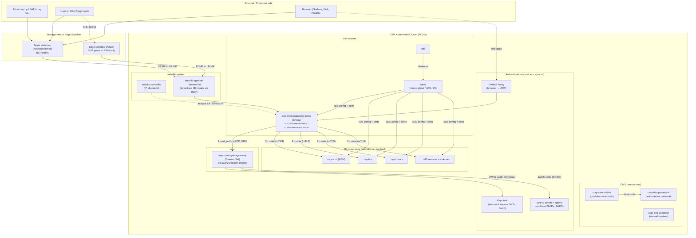

# CSM Networking & API Gateway Architecture

> A developer's field guide to how network traffic enters the HPE Cray EX (Shasta)
> **Cray System Management (CSM)** Kubernetes cluster, how the **API gateway**
> authenticates/authorizes it, how the **Istio service mesh** discovers and routes
> it to the right micro-service, and how to **trace and troubleshoot** it when
> something breaks.

**Audience:** CSM developers, SRE/operations, and support engineers.
**Scope:** The management plane (`ncn-m*` / `ncn-w*` Kubernetes cluster). Compute-node
and HSN fabric internals are out of scope except where they originate API traffic.

---

## How to read this set

This documentation is split into four focused chapters plus this index. Read them
in order for a full mental model, or jump straight to troubleshooting.

| # | Document | What it answers |
|---|----------|-----------------|
| — | **README.md** (this file) | Big picture, component inventory, the master diagram |
| 1 | [`01-network-and-entry-point.md`](./01-network-and-entry-point.md) | Where does a request *enter* the cluster? Networks (CMN/CAN/CHN/NMN/HMN), **MetalLB** load balancer, BGP, **DNS** resolution |
| 2 | [`02-api-gateway-and-request-flow.md`](./02-api-gateway-and-request-flow.md) | The **Istio ingress gateways**, **OPA** authorization, **Keycloak**/**SPIRE** tokens, **OAuth2 Proxy**, and a full **end-to-end request path traversal**. Ingress vs egress |
| 3 | [`03-service-mesh-discovery-observability.md`](./03-service-mesh-discovery-observability.md) | **Service mesh architecture**: `istiod`, **service & endpoint discovery** (xDS), sidecar injection, **mTLS**, and observability with **Kiali** + metrics |
| 4 | [`04-ingressgateway-logs-and-troubleshooting.md`](./04-ingressgateway-logs-and-troubleshooting.md) | **Reading `istio-ingressgateway` Envoy logs** (response code, request type, source IP), **tracing a request back to its origin**, and **playbooks** for "the API gateway is down" |

---

## The 30-second mental model

CSM does **not** use a traditional monolithic API gateway appliance. The "API gateway"
is an **assembly of cloud-native components** layered on Kubernetes:

```text
   Client → DNS → MetalLB (L3/BGP) → Istio Ingress Gateway (Envoy) → OPA (authz) → Istio mesh routing → micro-service
                  ───────────────    ─────────────────────────────   ──────────    ──────────────────
                  "which worker?"    "the front door / TLS / L7"      "may you?"    "which pod? (mТLS)"
```

1. **One URL, many services.** Every CSM REST API is exposed under a single host as
   `https://api.<network>.<system>.<domain>/apis/<service>/...`. TLS is terminated
   once, at the gateway.
   ([`docs-csm` Access_to_System_Management_Services.md](../docs-csm/operations/network/Access_to_System_Management_Services.md))
2. **Authentication & authorization happen only at the gateway.** A request must carry
   a valid **JWT** (from Keycloak for humans/services, or from SPIRE for compute
   workloads). Every call is checked by **Open Policy Agent (OPA)** before it ever
   reaches the micro-service.
   ([`docs-csm` API_Authorization.md](../docs-csm/operations/security_and_authentication/API_Authorization.md))
3. **The mesh does the rest.** Inside the cluster, **Istio** (Envoy sidecars +
   `istiod`) discovers services, load-balances across pod endpoints, and encrypts
   pod-to-pod traffic with **mutual TLS**.

> If you remember one thing: **the gateway is the only enforcement point, and OPA is
> the gate.** Most "the API is broken / 503 / 403" incidents are an
> authentication-plane problem (Keycloak, SPIRE, or OPA), *not* the target service.

---

## Master architecture diagram



**Reading the diagram:** A client name resolves (via DNS) to a MetalLB **EXTERNAL-IP**.
BGP/ECMP delivers the packet to any worker running an `istio-ingressgateway` Envoy pod
(the **entry point**). The gateway calls **OPA** over gRPC (**step 1**, `ext_authz`) to
authorize the request; OPA verifies the JWT against Keycloak's or SPIRE's JWKS. If
allowed, the gateway routes the request through the mesh to the target service pod over
**mTLS** (**step 2**). `istiod` continuously programs every Envoy (gateway and sidecars)
with service/endpoint config via **xDS**.

---

## Component inventory (maps to your live cluster)

The components below appear directly in `kubectl get all -A`. Namespaces and the role of
each are summarized so you can correlate the architecture with a running system.

| Layer | Namespace | Workload(s) | Kind | Role |
|-------|-----------|-------------|------|------|
| Load balancer | `metallb-system` | `metallb-controller`, `metallb-speaker` | Deploy + DaemonSet | Assigns and advertises `LoadBalancer` external IPs (BGP) |
| API gateway (data plane) | `istio-system` | `istio-ingressgateway`, `…-customer-admin`, `…-customer-user`, `…-hmn` | Deployment (HPA 3–6) | Edge Envoy proxies; TLS termination; L7 routing entry point |
| Mesh control plane | `istio-system` | `istiod` | Deployment (3–8) | Service discovery, xDS config push, sidecar injection, CA |
| Mesh observability | `istio-system` | `kiali` | Deployment | Service-mesh topology & health UI |
| Authorization | `opa` | `cray-opa-ingressgateway`, `…-customer-admin`, `…-customer-user`, `…-hmn` | DaemonSet | OPA `ext_authz` policy decision point for the gateway |
| Authentication (human/service) | `services` | `cray-keycloak`, `keycloak-postgres` | StatefulSet | Issues & signs JWTs; publishes JWKS |
| Authentication (workload) | `spire` | `cray-spire-server`, `cray-spire-agent`, `cray-spire-jwks` | StatefulSet + DaemonSet | Issues SPIFFE SVIDs/JWT-SVIDs to compute workloads; publishes JWKS |
| Browser SSO | `services` | `cray-oauth2-proxies-customer-{access,management,high-speed}-ingress` | Deployment + `LoadBalancer` | Converts browser sessions into JWTs for OPA enforcement |
| DNS (external/authoritative) | `services` | `cray-dns-powerdns` | Deployment + `LoadBalancer` | Authoritative DNS for `<system>.<domain>` |
| DNS (record publisher) | `services` | `cray-externaldns-external-dns` | Deployment | Writes Service/Gateway hostnames → PowerDNS |
| DNS (internal resolver) | `services` | `cray-dns-unbound` | Deployment + `LoadBalancer` | Resolves management-network names; CoreDNS upstream |
| Micro-services | `services` (+ others) | `cray-smd`, `cray-bos`, `cray-cfs-api`, `cray-bss`, … | Deployment | The actual REST APIs, each with an Envoy sidecar |

> **Note on your snapshot:** in the supplied `kubectl get all -A`, the gateway data plane
> (`istio-ingressgateway*`), control plane (`istiod`), load balancer (`metallb-*`) and
> `cray-opa-*` are all healthy, **but** `cray-keycloak` (`0/3 Init`), `keycloak-postgres`
> (`0/3 Init`), and the `spire` agents (`CrashLoopBackOff`) are **down**. That is an
> *authentication-plane* outage that will surface as gateway 401/403/503 errors even
> though the gateway itself is up. This exact scenario is worked through in
> [chapter 4](./04-ingressgateway-logs-and-troubleshooting.md#47-worked-example-diagnosing-the-supplied-cluster-snapshot).

---

## Source map (where this is implemented)

All claims here are grounded in the cloned `cray-hpe` repositories in this workspace:

| Concern | Repo / path |
|---------|-------------|
| Ingress gateways, Gateways, TLS, mTLS | `cray-istio/kubernetes/cray-istio-ingress/` |
| Mesh control plane (`istiod`) | `cray-istio/kubernetes/cray-istio-pilot/` |
| Istio source (Envoy/pilot, log format) | `istio/` |
| OPA `ext_authz` filter + Rego policies | `cray-opa/kubernetes/cray-opa/` |
| Browser SSO | `cray-oauth2-proxy/` |
| Load balancer | `cray-metallb/`, `metallb-installer/` |
| DNS | `cray-dns-powerdns/`, `cray-dns-unbound/`, `cray-externaldns/` |
| Mesh UI | `cray-kiali/` |
| Operations & troubleshooting docs | `docs-csm/operations/network/`, `docs-csm/operations/security_and_authentication/`, `docs-csm/operations/kubernetes/` |
| Architecture diagrams (PlantUML) | `casm-dev/architecture/opa/`, `casm-dev/architecture/spire/` |
| Per-system overrides | `shasta-cfg/customizations.yaml` |

Diagrams in this set use [Mermaid](https://mermaid.js.org/), which renders natively on
GitHub and in most Markdown viewers/IDEs.
